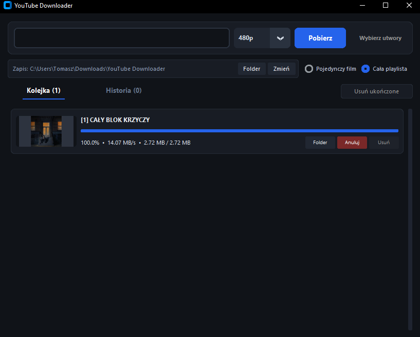
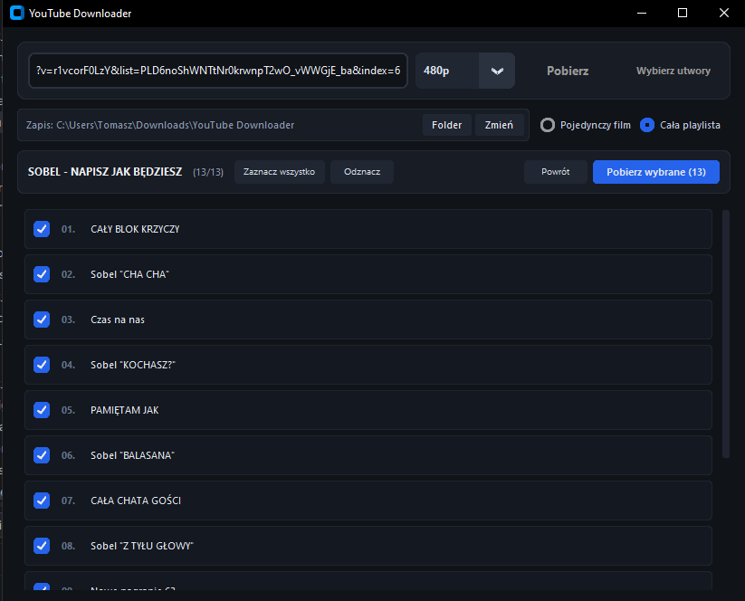
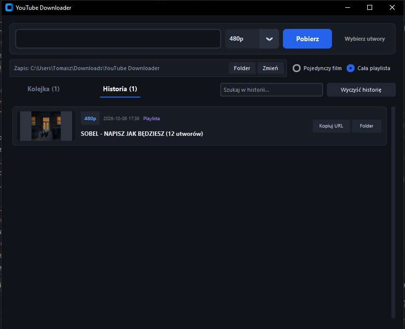

<div align="center">

# YouTube Downloader

Wydajny, desktopowy menedżer multimediów YouTube dla systemu Windows.  
Wielowątkowa kolejka zadań, selektywny bufor playlist, konwersja do MP3 oraz obsługa formatów panoramicznych.

[](https://github.com)
[](https://github.com)
[](https://github.com)
[](LICENSE)

</div>

---

## Prezentacja interfejsu

### 1. Główny widok kolejki pobierania
Menedżer zadań z aktywną telemetrią (postęp, prędkość, rozmiar danych) oraz możliwością anulowania i usuwania wpisów.
<p align="center">
  
</p>

### 2. Selektywny wybór utworów z playlisty
Lokalny cache metadanych w pamięci RAM pozwalający na zaznaczanie wybranych pozycji przed pobraniem.
<p align="center">
  
</p>

### 3. Rejestr historii pobrań
Baza lokalna z historią ukończonych pobrań, etykietami formatów oraz szybkim dostępem do plików.
<p align="center">
  
</p>

---
---

## Funkcjonalności

<table>
<tr>
<td width="33%" valign="top">

### Pobieranie i konwersja

- **Profile rozdzielczości**: od 480p, przez 720p, 1080p i 1440p, aż do 4K (2160p), scalane przez FFmpeg.
- **Ekstrakcja MP3**: konwersja strumienia audio do 192 kbps wraz z okładką albumu w tagach ID3.
- **Wielowątkowość**: asynchroniczna kolejka pobierania (`ThreadPoolExecutor`) chroniąca GUI przed zawieszeniem.
- **Detekcja duplikatów**: weryfikacja obecności pliku na dysku zapobiega ponownemu pobieraniu tych samych danych.
- **Sprzątanie przerwanych zadań**: bezpieczne usuwanie pozostałości plików tymczasowych (`.part`, `.ytdl`).

</td>
<td width="33%" valign="top">

### Zaawansowane playlisty

- **Interaktywny selektor**: opcja pobrania całej playlisty lub wskazania konkretnych pozycji.
- **Buforowanie w pamięci (RAM cache)**: jednokrotnie pobrana playlista otwiera się natychmiast, bez kolejnych zapytań sieciowych.
- **Pełna responsywność wiersza**: kliknięcie w dowolne miejsce elementu listy przełącza stan zaznaczenia.
- **Podsumowania z fleksją**: zliczanie fizycznie pobranych plików z zachowaniem polskiej odmiany (`1 utwór`, `3 utwory`, `12 utworów`).

</td>
<td width="33%" valign="top">

### Automatyzacja i UX

- **Inteligentny schowek**: najechanie kursorem na pole adresu weryfikuje schowek i wkleja poprawny URL bez `Ctrl+V`.
- **Sanityzacja adresów**: automatyczne odcinanie parametrów śledzących z zachowaniem identyfikatorów wideo i playlist.
- **Filtrowanie na żywo**: dynamiczne wyszukiwanie w historii pobranych plików w czasie rzeczywistym.
- **Retencja ustawień**: automatyczny zapis ścieżki docelowej oraz preferencji formatu w pliku konfiguracyjnym.
- **Telemetria**: precyzyjny odczyt prędkości, pobranych megabajtów, ETA oraz etapu scalania strumieni.

</td>
</tr>
</table>

---

## Architektura i wyzwania inżynieryjne

<details>
<summary><strong>1. Zarządzanie stanem i licznik sesji playlisty (QueueManager)</strong></summary>

<br>

Domyślne metadane platformy operują na bezwzględnych pozycjach utworów w obrębie całej playlisty (`playlist_index`). Wybranie np. 4 pozycji ze środka listy (utwory 10–13) w standardowych implementacjach prowadzi do mylącego zapisu postępu w interfejsie (`[10/4]`, `[11/4]`).

W warstwie `QueueManager` zaimplementowano lokalny licznik sekwencji sesyjnej:

- oddziela fizyczny indeks utworu w serwisie od stanu bieżącej kolejki,
- prezentuje czytelną dla użytkownika numerację `[1/4]... [4/4]`.

</details>

<details>
<summary><strong>2. Normalizacja rozdzielczości formatów panoramicznych (2.40:1)</strong></summary>

<br>

Materiały panoramiczne i kinowe (np. zwiastuny filmowe, teledyski) charakteryzują się mniejszą wysokością klatki niż standard 16:9 (np. 1920x800 px zamiast nominalnego 1920x1080 px).

Weryfikacja jakości oparta wyłącznie na wysokości skutkowałaby fałszywym ostrzeżeniem o pobraniu gorszego standardu. Moduł `normalize_resolution_label` bada geometrię klatki oraz jej szerokość, poprawnie klasyfikując wideo do odpowiednich progów rozdzielczości (480p, 720p, 1080p, 1440p, 4K).

</details>

<details>
<summary><strong>3. Dwufazowa alokacja ścieżek dla zbiorów złożonych</strong></summary>

<br>

Pobieranie wyselekcjonowanych pozycji bezpośrednio przez silnik gubi kontekst nadrzędnej playlisty, co w szablonach zapisu powoduje tworzenie podkatalogów o nazwie `NA/`.

Rozwiązano to poprzez dwufazowe przetwarzanie:

- wstępne pobranie metadanych spisu w trybie płaskim (`extract_flat`),
- oczyszczenie nazwy albumu ze znaków niedozwolonych w systemie Windows (`\ / : * ? " < > |`),
- fizyczne utworzenie katalogu docelowego i skierowanie do niego pobieranych plików.

</details>

<details>
<summary><strong>4. Izolacja wątków i maszyna stanów UI</strong></summary>

<br>

Pętla główna interfejsu (`MainThread`) nie wykonuje żadnych blokujących operacji wejścia/wyjścia ani zapytań sieciowych. Wszystkie operacje realizowane są w tle i raportowane przez kolejkę komunikatów `EventBus`.

Przejście do widoków modalnych (np. selekcja utworów) blokuje kontrolki nadrzędne, uniemożliwiając równoległe wywołanie kolidujących operacji.

</details>

---

## Struktura projektu

```text
youtube-downloader/
│
├── core/
│   ├── downloader.py       # Silnik pobierania, integracja yt-dlp i FFmpeg
│   ├── events.py           # Magistrala zdarzeń (EventBus) łącząca wątki robocze z GUI
│   ├── models.py           # Modele danych (dataclass, enum)
│   └── queue_manager.py    # Orkiestracja wątków, licznik sesji, weryfikacja plików
│
├── gui/
│   ├── components/         # Modułowe paski interfejsu (TopBar, PathBar, NavBar)
│   ├── views/              # Widoki ekranowe (HistoryView, SelectionView)
│   ├── app.py              # Główne okno programu i zarządca stanów UI
│   └── task_card.py        # Karta pojedynczego zadania pobierania z telemetrią
│
├── utils/
│   ├── config.py           # Odczyt i zapis konfiguracji użytkownika (JSON)
│   ├── formatters.py       # Normalizacja rozdzielczości, formatowanie jednostek
│   ├── history.py          # Lokalna baza danych pobranych pozycji
│   └── paths.py            # Rozwiązywanie ścieżek systemowych i lokalizacji FFmpeg
│
├── main.py                 # Punkt wejścia do aplikacji
├── requirements.txt        # Spis zależności bibliotecznych
└── settings.json           # Automatycznie generowane ustawienia programu
```

---

## Wdrożenie i uruchomienie

<table>
<tr>
<td width="50%" valign="top">

### Wersja samodzielna (`.exe`)

Dedykowana dla użytkowników końcowych, bez wymagań systemowych.

1. Przejdź do sekcji [**Releases**](../../releases) po prawej stronie repozytorium.
2. Pobierz najnowszy plik **`YouTubeDownloader.exe`**.
3. Uruchom program dwuklikiem.

> **Uwaga:** binaria FFmpeg oraz środowisko wykonawcze zostały skonsolidowane wewnątrz kontenera aplikacji. Program nie wymaga instalacji Pythona.

</td>
<td width="50%" valign="top">

### Uruchomienie ze źródeł (Python)

Dedykowane do celów rozwojowych i audytu kodu.

**Wymagania wstępne:**

- `Python >= 3.10`
- `ffmpeg.exe` oraz `ffprobe.exe` w katalogu projektu lub w zmiennej systemowej `PATH`

</td>
</tr>
</table>

### Procedura startowa ze źródeł

```bash
# 1. Klonowanie repozytorium
git clone https://github.com/TomaszMarek/youtube-downloader.git
cd youtube-downloader

# 2. Instalacja wymaganych pakietów
pip install -r requirements.txt

# 3. Inicjalizacja procesu aplikacji
python main.py
```

---

## Stos technologiczny

| Kategoria | Komponent | Zastosowanie |
| :--- | :--- | :--- |
| Język bazowy | Python 3.10+ | Logika biznesowa, orkiestracja zadań |
| Interfejs GUI | CustomTkinter | Responsywny interfejs graficzny w trybie ciemnym |
| Silnik ekstrakcji | yt-dlp | Parsowanie strumieni DASH i metadanych serwisu |
| Przetwarzanie multimediów | FFmpeg | Multipleksowanie strumieni A/V, konwersja do MP3, tagowanie ID3 |
| Kompilacja binarna | PyInstaller | Budowanie autonomicznego pliku wykonywalnego `.exe` |

<p align="center">
  
  
  
  
  
</p>

---

## Licencja

Projekt jest dystrybuowany na warunkach otwartoźródłowej licencji **MIT**. Szczegółowe postanowienia prawne znajdują się w pliku [`LICENSE`](./LICENSE).

Zgłoszenia błędów oraz propozycje zmian są mile widziane w sekcji [Issues](../../issues).
